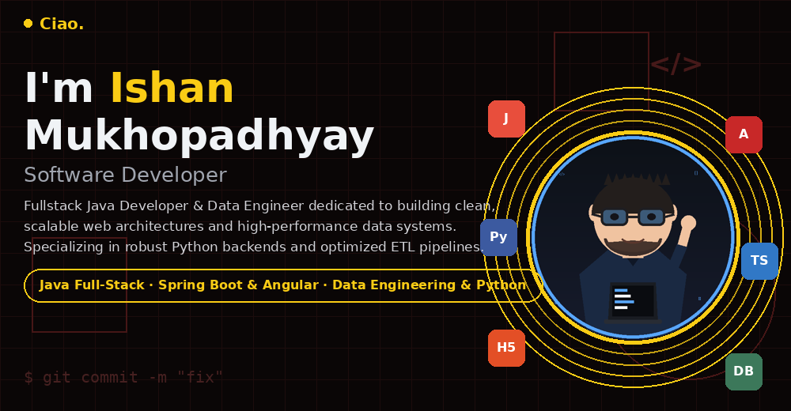

<h1 align="center">Ciao. I'm Ishan Mukhopadhyay 👋</h1>

  

  

  <!-- Years Exp: manual, no public API tracks this — bump the "3.8" as time passes -->
  
  <!-- Repo count: LIVE, pulled from the GitHub API automatically — no editing needed -->
  
  <!-- Companies: manual, update when it changes -->
  

  
  &nbsp;&nbsp;
  
  &nbsp;&nbsp;
  
  &nbsp;&nbsp;
  

---

### 🚀 About Me

  

<!-- Static fallback text (some viewers/clients don't animate GIFs) -->

<i>Show as plain text</i>

Fullstack Java Developer & Data Engineer dedicated to building clean, scalable web architectures and high-performance data systems. Specializing in robust Python backends and optimized ETL pipelines.

- 💻 Fullstack Java Developer & Data Engineer, building clean, scalable systems out of Kolkata, India
- 🏢 Currently a Software Engineer working across client projects (insurance-domain platforms) after starting out as a Data Engineer Intern
- 🌱 Currently exploring: Data Engineering, ETL pipelines, LLMs
- 📸 Off the keyboard: HIPA Merit Award-winning photographer, documenting India's streets, travel, and stories through the lens
- 💬 Ask me about: Angular, Spring Boot, ETL pipelines, or photography in India

---

### 🏢 Companies I've Worked At

<!-- Placeholder — swap in your real company names, logos, and dates. -->
<!-- Logo idea: https://cdn.simpleicons.org/<companyslug>/FACC15 if the company has a Simple Icons entry, otherwise use their favicon URL. -->

| Company | Role | Duration |
|---|---|---|
| *(Company A — edit me)* | Software Engineer | *(e.g. 2023 – Present)* |
| *(Company B — edit me)* | Data Engineer Intern | *(e.g. 2022 – 2023)* |

---

### 🛠️ Skills & Tools

<table>
<tr>
<td width="60%" valign="top">

**Languages & Tools** — animated, in the same style as popular "moving logo" tech stacks:

<!-- These are from the well-known "Moving Logos" animated GIF set (linked below).
     I pulled a representative sample — since they're unlabeled thumbnails, preview
     the full sheet and swap in the exact ones for your stack: 
     https://github.com/Anmol-Baranwal/Cool-GIFs-For-GitHub#moving-logos -->

  
  
  
  
  
  
  

**Static alternative** (hover any icon for its name):

  
  
  
  
  
  
  
  
  
  

</td>
<td width="40%" valign="top" align="center">
  
</td>
</tr>
</table>

---

### 📊 GitHub Stats

  
  

  

---

### 📈 Contribution Activity

  

---

### 🧩 Profile Summary

  
  

  
  

---

### 🏆 Trophies

  

---

### 🎨 Creative Side

  

  

<!-- Static fallback text -->

<i>Show as plain text</i>

A **HIPA International Photography Merit Award** winner (2023, Diversity — Creative Art Section), capturing documentary, street, and travel stories across India. Every frame is purposeful — rooted in observation, composed with intention.

| Focus | Details |
|---|---|
| 📸 Photography | Documentary, street & travel photography |
| 🗺️ Travel & Exploration | Adventures across Incredible India |
| 🖌️ Photoshop | Advanced post-processing for refined, emotive imagery |
| 🎞️ Lightroom | Precision colour grading & catalog management |
| 🏆 Achievement | HIPA Merit Award, Theme: Diversity (2023) |

  
  &nbsp;&nbsp;
  

---

  

<i>Every frame is purposeful, every commit intentional — thanks for stopping by! 🖤</i>

