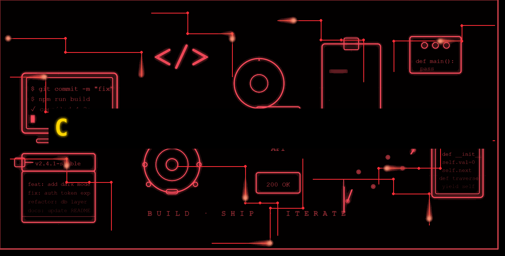

  

  
  
  

<h4 align="center">Full-Stack Engineer @ Cognizant · Upskilling in Data Engineering & Python · Spring Boot & Angular</h4>

  
  &nbsp;&nbsp;&nbsp;&nbsp;
  
  &nbsp;&nbsp;&nbsp;&nbsp;
  
  &nbsp;&nbsp;&nbsp;&nbsp;
  &nbsp;&nbsp;&nbsp;&nbsp;
  

---

### 🚀 About Me

🚀 Java Full-Stack Engineer | Spring Boot & Angular | Currently upskilling in Data Engineering & Python 🐍 | Driven by scalable code & AI-assisted dev.

- 💼 Full-stack engineer with 4+ years building and maintaining production systems in **Java / Spring Boot** on the backend and **Angular** on the frontend.
- 📚 Currently deepening skills in **Data Engineering** and **Python**, with an eye toward pipeline and analytics work.
- 🤝 Comfortable working across the stack — from REST APIs and relational data models to responsive UI — and increasingly working with AI-assisted development workflows.
- 🎯 Currently focused on growing in data engineering and Python while building practical, production-ready solutions. Open to Data engineering opportunities where I can build scalable systems and grow in data-driven development.

---

### 🛠️ Skills & Tools

<table>
  <tr>
    <!-- BACKEND -->
    <td align="center" width="33%" valign="top">
      <b>Backend</b>  
      
      
      
      
    </td>
    <!-- FRONTEND -->
    <td align="center" width="33%" valign="top">
      <b>Frontend</b>  
      
      
      
      
      
    </td>
    <!-- TOOLS & PLATFORMS -->
    <td align="center" width="33%" valign="top">
      <b>Tools & Platforms</b>  
      
      
      
      
      
      
      
    </td>
  </tr>
  <tr>
    <!-- DATABASES -->
    <td align="center" width="33%" valign="top">
      <b>Databases</b>  
      
      
    </td>
    <!-- DATA ENGINEERING -->
    <td align="center" width="33%" valign="top">
      <b>Data Engineering</b>  
      
      
    </td>
    <!-- APIS & INTEGRATION -->
    <td align="center" width="33%" valign="top">
      <b>APIs & Integration</b>  
      
      
    </td>
  </tr>
  <tr>
    <!-- TESTING & QUALITY -->
    <td align="center" width="33%" valign="top">
      <b>Testing & Quality</b>  
      
      
    </td>
    <!-- PRODUCTIVITY & WORKFLOW -->
    <td align="center" width="33%" valign="top">
      <b>Productivity & Workflow</b>  
      
      
      
    </td>
    <!-- AI TOOLS I USE -->
    <td align="center" width="33%" valign="top">
      <b>AI & Observability Tools</b>  
      
      
      
    </td>
  </tr>
</table>

---

### 🛠️ Professional Experience

<table>
  <tr>
    <!-- Cognizant -->
    <td align="left justify" width="33%" valign="top">
      <b>Cognizant</b>  
      
1. Built and modernized data ingestion microservices with Spring Boot, improving platform integration and operational efficiency across 6 legacy systems.
 
      
2. Led backend delivery and observability improvements, strengthening reliability, security, and team productivity while mentoring junior engineers.

    </td>
    <!-- EY -->
    <td align="left justify" width="33%" valign="top">
      <b>EY</b>  
      
1.Designed optimized star-schema data models and tuned heavy Oracle SQL stored procedures, reducing automated  report generation processing time by ~40%.
 
        
2.Performed exploratory data analysis on datasets containing over 1 million rows, surfacing actionable revenue-trend insights for senior stakeholders.
      

    </td>
  </tr>
</table>

---

### 📌 Featured Projects

<table>
  <tr>
    <td valign="top">
      <strong><a href="https://github.com/IshanM1997/PySpark-Cleaning-Pipeline">PySpark-Cleaning-Pipeline</a></strong> 
      📑 <em>A production-style PySpark ETL pipeline that ingests a raw e-commerce orders CSV, performs deep data cleaning using Apache Spark's distributed DataFrame API, and outputs partitioned Parquet files with a JSON quality report — all designed to scale to millions of rows.</em> 
      🛠️ <code>PySpark</code> <code>Python</code> <code>Apache Spark</code>
    </td>
    <td valign="top">
      <strong><a href="https://github.com/IshanM1997/E-commerce-website">ShopSphere — E-Commerce Platform</a></strong> 
      📑 <em>A production-ready e-commerce application with Angular 17 frontend, Spring Boot 3 backend, and MySQL database. Integrates the free FakeStoreAPI to auto-populate products.</em> 
      🛠️ <code>Java</code> <code>Spring Boot</code> <code>Angular</code> <code>TypeScript</code>
    </td>
  </tr>
  <tr>
    <td valign="top">
      <strong><a href="https://github.com/IshanM1997/CSV-to-BigQuery">CSV-to-BigQuery</a></strong> 
      📑 <em>Automated data ingestion engine converting raw local CSV streams into structured BigQuery data warehouses.</em> 
      🛠️ <code>Python</code> <code>Google BigQuery</code> <code>ETL</code>
    </td>
    <td valign="top">
      <strong><a href="https://github.com/IshanM1997/Weather-forecast-app">Weather App</a></strong> 
      📑 <em>Angular based weather app with 5 days weather prediction and live weather update based on location.</em> 
      🛠️ <code>Angular</code> <code>TypeScript</code> <code>HTML</code> <code>CSS</code>
    </td>
  </tr>
  <tr>
    <td valign="top">
      <strong><a href="https://github.com/IshanM1997/Real-time-pipeline-monitor">Real-time-pipeline-monitor</a></strong> 
      📑 <em>Live observability dashboard tracking data freshness metrics, stream volume variances, and ETL health states.</em> 
      🛠️ <code>Python</code> <code>Apache Airflow</code> <code>Datadog</code>
    </td>
    <td valign="top">
      <strong><a href="https://github.com/IshanM1997/JiraLite-Project-Management-Tool">JiraLite — Project Management Tool</a></strong> 
      📑 <em>A full-stack Jira-inspired project management app built with Django REST Framework and Angular 17 + Angular Material. Covers workspaces, boards, Kanban columns, tickets with drag-and-drop, comments, file attachments, and role-based permissions.</em> 
      🛠️ <code>Python</code> <code>Angular</code> <code>TypeScript</code>
    </td>
  </tr>
</table>

---

### 📊 GitHub Analytics & Profile Summary

  
  

  
  

---

### 📈 Contribution Activity

  

---

### 🎨 Beyond Code
<h4 align>Explorer · Adventurer · Foodie · Every frame is an authentic visual story.</h4>

A HIPA Merit Award-winning photographer dedicated to experiencing and capturing the vibrant soul of Incredible India. Armed with Nikon Z6III & D5300 and refined by advanced Adobe Photoshop editing — specializing in documentary, street, and travel photography.

---

### 🛠️ Skills & Tools

<table width="100%">
  <tr>
    <!-- Photo Editing -->
    <td align="center" valign="top">
      <b>Photo Editing</b>  
      
      
      
    </td>
    <!-- Video Editing -->
    <td align="center" valign="top">
      <b>Video Editing</b>  
      
      
    </td>
  </tr>
</table>

---

  

<i>Every frame is purposeful, every commit intentional — thanks for stopping by! 🖤</i>
